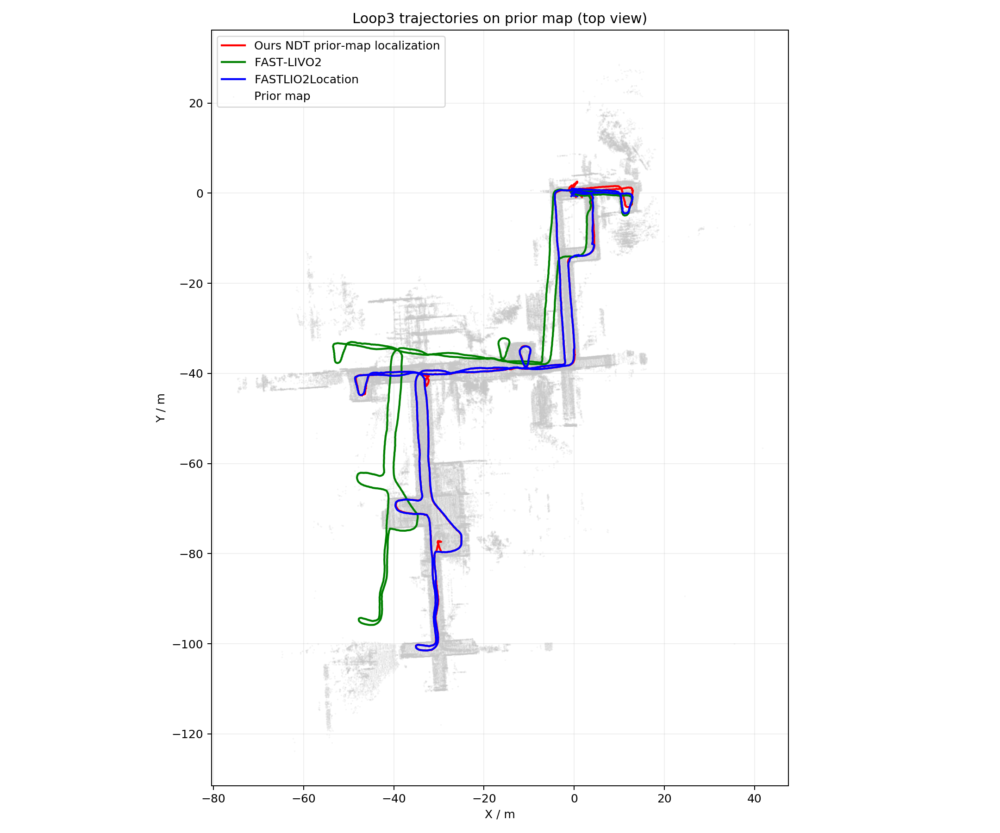
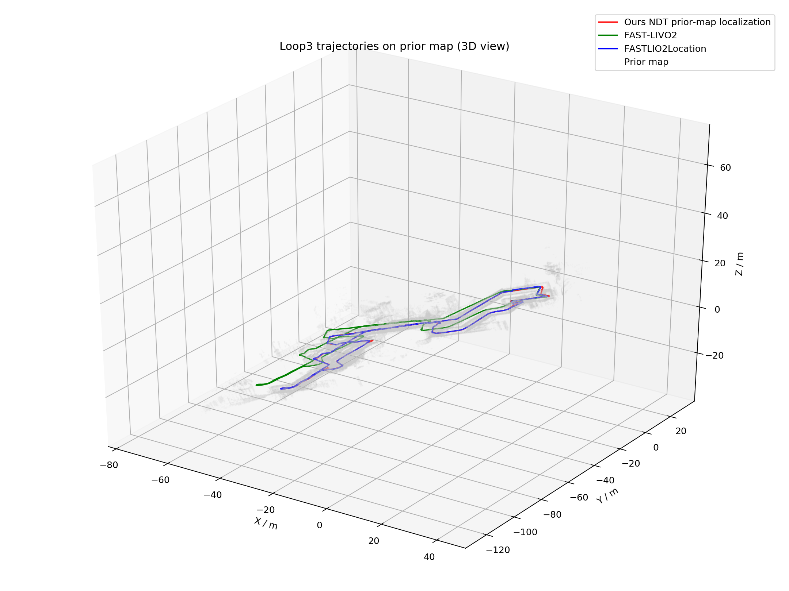

# 机器狗先验地图定位与 FAST-LIVO2 / FASTLIO2Location 对比报告

日期：2026-08-28 
数据集：`loop3_2026-08-11-16-09-07.bag` 
先验地图：FAST-LIVO2 离线建图结果，PCD 路径为 `/home/jian/rosbag/loop2/loop2mapping/pcd/loop2_simtime_rebuild_2026_08_12_001_all_downsampled_points.pcd`

## 1. 对比目标

本次对比主要验证三种定位/里程计算法在同一室内楼道、楼梯与重复拐角场景中的轨迹表现：

| 算法 | 输入 | 输出话题 | 作用定位 |
| --- | --- | --- | --- |
| 本文算法：NDT 先验地图定位 | `/livox/lidar`、`/livox/imu`、先验地图 | `/dog_livo/ndt_odom` | 面向机器狗端低算力部署的先验地图定位 |
| FAST-LIVO2 | LiDAR + IMU + camera | `/aft_mapped_to_init` | 视觉-惯性-激光 SLAM / 建图定位基线 |
| FASTLIO2Location | LiDAR + IMU + prior map | `/localization` | 先验地图定位参考基线 |

本文算法不使用数据集自带位置话题作为实时先验；FASTLIO2Location 轨迹仅用于离线评估和可视化对比。

## 2. 本文算法当前默认配置

清理后的默认版本只保留当前有效的 NDT 主链路：当前帧点云预处理、全局先验地图 NDT 配准、上一帧结果恒速传播初值、连续帧 step limit 限幅，以及定位结果发布。已经移除默认关闭且实验效果不好的 NDT 分支，例如多帧源点云、外部初值、内部 ICP 初值、acceptance gate、coast、large-jump guard、ambiguity diagnostics、temporal consistency、motion prior guard、prior candidate 等。

当前默认关键参数如下：

| 参数 | 数值 | 说明 |
| --- | ---: | --- |
| `ndt_source_voxel_size` / `ndt_source_voxel_z_size` | 0.25 m | 当前帧点云降采样，保留较丰富结构 |
| `ndt_target_voxel_size` / `ndt_target_voxel_z_size` | 0.15 m | 先验地图 NDT target 体素，更细地图有利于楼梯/拐角结构区分 |
| `ndt_max_source_points` | 1400 | 控制单帧计算量 |
| `ndt_max_target_points` | 0 | 全图 target 不截断 |
| `ndt_resolution` | 0.8 m | NDT 网格分辨率 |
| `ndt_step_size` | 0.08 | NDT 优化步长 |
| `ndt_max_iterations` | 40 | NDT 最大迭代次数 |
| `ndt_step_limit_max_translation` | 0.5 m | 限制单帧异常平移跳变 |
| `ndt_step_limit_max_rotation_deg` | 5 deg | 限制单帧异常旋转跳变 |

## 3. 轨迹叠加可视化

图中灰色为先验地图，红色为本文算法，绿色为 FAST-LIVO2，蓝色为 FASTLIO2Location。圆点表示起点，叉号表示终点。

同时导出了可在 CloudCompare / PCL Viewer 中打开的彩色轨迹 PCD：

- `/home/jian/rosbag/loop3/report_three_algo_20260828_135951/three_algorithm_trajectories_rgb.pcd`：只包含三条彩色轨迹
- `/home/jian/rosbag/loop3/report_three_algo_20260828_135951/prior_map_with_three_algorithm_trajectories_rgb.pcd`：灰色先验地图 + 三条彩色轨迹
- 红色：本文算法；绿色：FAST-LIVO2；蓝色：FASTLIO2Location

## 4. 定量结果

### 4.1 本文算法与 FASTLIO2Location 的全包对齐误差

以 FASTLIO2Location `/localization` 作为离线参考，对本文算法 full-bag 轨迹做起点对齐评估，当前保留版本结果如下：

| 指标 | 数值 |
| --- | ---: |
| mean | 0.417 m |
| RMSE | 0.618 m |
| median | 0.245 m |
| p90 | 1.243 m |
| p95 | 1.535 m |
| max | 2.694 m |
| NDT corrected rate | 约 10 Hz |

关键局部窗口表现：

| 场景窗口 | mean | p95 | max | 说明 |
| --- | ---: | ---: | ---: | --- |
| 390-410 s 楼梯/拐角 | 0.281 m | 0.868 m | 1.781 m | 相比旧 baseline 的最大 5.608 m 明显降低 |
| 420-445 s 拐角段 | 0.276 m | 0.605 m | 0.640 m | 已基本贴合参考轨迹 |
| 455-572 s 末端/静止附近 | 0.399 m | 1.036 m | 2.694 m | 剩余最大误差集中在末端/静止附近 |

### 4.2 三条轨迹自身统计

| 算法 | 点数 | 轨迹长度 | 起终点距离 |
| --- | ---: | ---: | ---: |
| 本文算法 | 5804 | 450.710 m | 1.094 m |
| FAST-LIVO2 | 3430 | 414.009 m | 0.0069 m |
| FASTLIO2Location | 2789 | 415.085 m | 0.0393 m |

说明：本文算法输出为约 10 Hz 的先验地图 NDT 定位轨迹；FAST-LIVO2 与 FASTLIO2Location 输出频率和后端处理逻辑不同，轨迹长度和采样点数不能直接等同于定位精度，主要用于整体形状和闭环一致性参考。

## 5. 现象分析

1. 本文算法在大多数走廊和拐角段能够贴合 FASTLIO2Location，尤其在 420-445 s 窗口，p95 已接近 0.6 m。
2. 相比早期 NDT baseline，细化 source/map 体素并增加 source 点数后，楼梯/拐角处误吸附明显减少。
3. 单纯继续调大点数、缩小 target voxel 或收紧平移/旋转阈值并不单调改善结果，部分组合会在重复结构处产生更强错误吸引子。
4. FAST-LIVO2 和 FASTLIO2Location 的首尾静止段闭合更好，说明视觉/后端地图定位在闭环一致性上仍有优势。
5. 本文算法当前优势是链路简单、可部署、传感器约束明确；不足是重复拐角和末端静止附近仍存在少量误匹配峰值。

## 6. 结论与下一步

当前推荐保留本文算法的默认 NDT 配置，不再保留大量默认关闭的实验开关。该版本相对早期参数 baseline 明显降低楼梯和拐角误匹配，但尚未达到全程 `max < 0.5 m` 的最终目标。下一步更值得做的是针对高风险帧设计轻量的一致性判别，例如基于 IMU/视觉前端传播方向的局部候选约束，而不是继续进行全局参数暴力扫描。

报告素材输出目录：`/home/jian/rosbag/loop3/report_three_algo_20260828_135951`。
